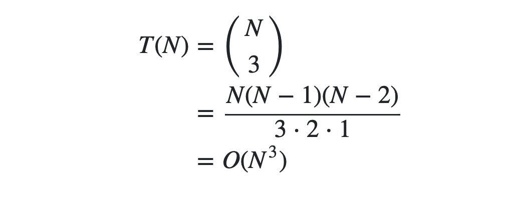
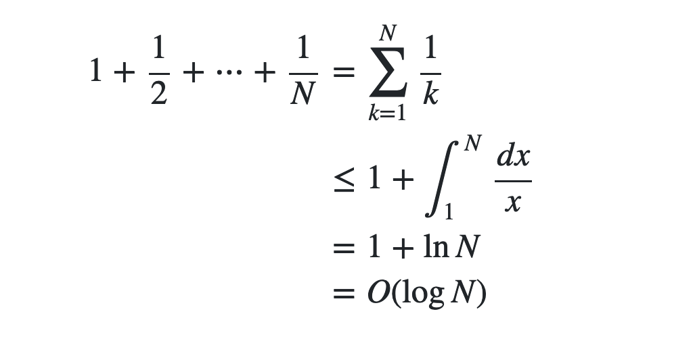

# 第２章の章末問題の解答


## 問題2.1

解答は以下の画像の通り。


問題2.1に限って考えると、O(N) <= O(NlogN) <= O(N√N) <= O(N^2) <= ... <= O(2^N) という関係になる。


## 問題2.2

問題文後半から、N個から3個選ぶ組合せの数を求めれば良いことがわかる。よって答えは以下の通り。




## 問題2.3

forループの終了条件が```p * p <= N```であることから、pは√N以下の自然数である。よって計算量はO(√N)。


## 問題2.4

「Aさんの年齢が 0 歳以上 2^k 歳未満であると判明しているとき、二分探索法によってk回の質問で年齢を当てられる」という主張は正しいか。「Aさんの年齢の可能性が2^k通りであるとき、二分探索法によってk回の質問で年齢を当てられる」という主張に言い換えて、数学的帰納法を用いて明らかにする。

- Aさんの年齢が1歳未満（**k=0**）のとき：可能性が0歳のみなので、探索せずに（すなわち０回探索して）年齢を0歳と当てられる。よって主張を満たす。

ここで、「Aさんの年齢の可能性が2^k通りであるとき、k回の質問で年齢を当てられる」と仮定する。

年齢の範囲を2倍にしたとき（つまり年齢が2^(k+1)通りのとき）、「Aさんは2^k歳未満ですか？」という質問によって、

- 0 歳以上 2^k 歳未満
- 2^k 歳以上 2^(k+1) 歳未満

の2通りに場合分けできる。そして、それぞれの場合で年齢の可能性は2^k通りあり、仮定よりk回の質問で年齢を当てられる。以上より、1回の質問の後k回の質問をして年齢を当てられることから、「Aさんの年齢の可能性が2^(k+1)通りであるとき、k+1回の質問で年齢を当てられる」ことがわかる。

よって、数学的帰納法により問題の主張が正しいことが示された。


## 問題2.5

問題2.4より、N = 2^k (k: 0以上の自然数) と表せる場合、年齢を当てるために必要な質問の回数はきっかり T(N) = log2 N であり、T(N) = k = log N = O(log N) であることがわかる。

一方、一般の自然数Nに対しては 2^{j-1} < N <= 2^j と表せる自然数jが存在する。このとき、0歳以上N歳未満の人間の年齢を当てるためにはj回の質問が必要である（例えばN = 100のとき、j = 7）。式変形すると、jとNは常に不等式 log N <= j < log N + 1 を満たすことがわかる。つまり、j = log N + c（c: [0, 1)に含まれる実数）となるcが存在する。よってT(N) = j = log N + c = O(log N) が言える。


## 問題2.6

log x の微分が 1/x であることを利用し、逆に総和の形を積分の形で抑えれば良い。[著者様の解答例](https://github.com/drken1215/book_algorithm_solution/blob/master/solutions/chap02.md)には理解を助けるグラフが載っている（ (x, y) = (1, 1) の座標がやけにy軸方向に伸びているのでややわかりづらいが、一番左側の長方形の面積が1である）。

